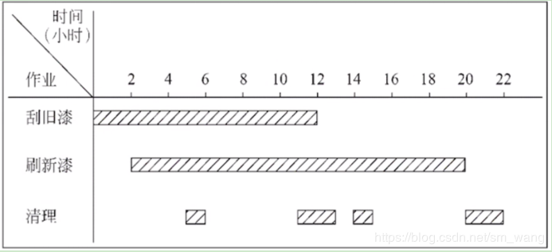
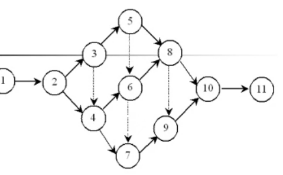
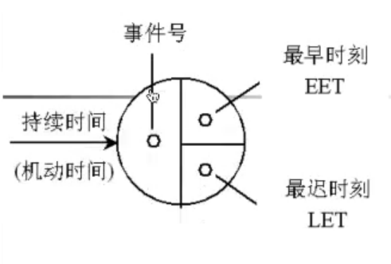
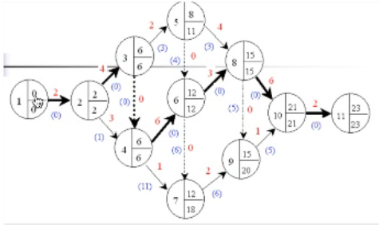

# 软件项目管理

1. 启动一个项目
2. 度量
3. 估算
4. 风险计算
5. 进度安排
6. 追踪与安排

# 软件生产效率和质量的度量

- 度量 提供了一个产品开发过程中的某个属性程度或产品属性的定量提示

## 面向功能的度量

- 面向功能的度量是对软件和软件开发过程的间接度量，注意力集中于程序的功能和实用性，使用应用程序提交的功能的量作为度量的值。

- 输入参数

  - 用户输入数量
  - 用户输入数量
  - 文件数量
  - 外部接口数量
  - 用户查询数量

- 14个产品因素

  i. 该系统需要可靠的备份和恢复吗

  ii. 要求数据通讯吗

  iii. 由分布处理功能吗

  iv. 性能是关键的吗

  v. 该系统将运行在现存的负载的操作系统吗

  vi. 该系统需要在先输入吗

  vii. 在线输入数据需要多屏或者多个操作吗

  viii. 主文件是在线更新吗

  ix. 输入输出文件和查询是复杂的吗

  x. 内部处理是复杂的吗

  xi. 设计和编码是可以再使用的吗

  xii. 转换和安装包括在设计中了吗

  xiii. 该系统的设计是准备在不同的组织中多次安装吗

  xiv. 该系统的设计是为了方便修改和用户容易使用吗

## 软件项目的估算

- 三点值估算软件项目规模
  - 将问题分解成一些功能，然后分别估计
  - 通过计算乐观值，最可能值 保守值的加权平均来进行计算
  - 特点
    - 需要经验
    - 主观性

## 开发成本估计

软件项目管理过程是从一组项目计划活动开始，而第一项活动就是估算，由于估算是其它项目活动的基础，而项目计划为软件过程指出了成功的道路，所以必须充分重视估算活动

成本估算和成本管理是软件管理的核心任务之一，为了使开发项目能够在规定的时间内完成，而且不超过预算，成本估算和管理控制使关键。

- 基本估算的方法分三类

  i. 自定向上的估算方法

  ii. 自底向上的估算方法

  iii. 差别估算法

- 专家判定技术

  i. 组织者为每位专家提供一份软件规格说明书和一张估算表

  ii. 专家详细研究软件规格说明书的内容

  iii. 各位专家对该软件提出三个规模的估算值 最小规模 最大规模 最可能规模 进行加权平均

  iv. 计算估算值

## 进度计划

#### 进度计划步骤

1. 确定软件开发小组人数
2. 任务的确定及其并行性
3. 制定开发进度计划

#### 甘特图(Gantt)

> 假设有一座陈旧的木板房需要重新油漆，分为三步

1. 首先挂掉旧漆
2. 然后重新上漆
3. 最后清除溅在窗户上的油漆

> 假设一共分配了15名工人完成这项工作，但工具都很有限：5把刮旧漆的刮板，5把刷新漆的刷子，5把用来清除溅在窗户上油漆的小刮刀。该如何安排工作才更有效呢？

- 一种做法就是依次进行，先刮掉旧漆，然后再刷上新漆，然后再清除，显然这样的效率不高
- 另一种做法是流水线做法，即首先5名工人刮掉一面墙上的旧漆，当第一面墙刮干净后，另外5名工人立马给这面墙刷新漆，与此同时，拿刮板的工人转去刮第二面墙上的旧漆。一旦刮旧漆的转到第三面墙并且刷新漆的工人转到第二面墙后，余下的工人立即拿起刮刀去清除第一面墙，以此类推。

> 假设木板房的第2、4面墙的长度比第1、3面的长度长一倍，此外不同工作需要的时间长短也不一样

| 墙壁\工序 | 刮旧漆 | 刷新漆 | 清除 |
| :-------: | :----: | :----: | :--: |
|   1或3    |   2    |   3    |  1   |
|   2或4    |   4    |   6    |  2   |

- 使用甘特图描绘上述流水线过程：在时间为0时刮第一面墙的旧漆，2小时后刮旧漆的工人转去第二面墙，同时5名工人开始第一面墙的刷漆，每当给一面墙刷完漆后，第三组5名工人立马进行清理，从下图可以看出12h后刮完所有旧漆，20小时后完成所有墙壁的刷漆工作，再过2小时清理工作结束。

- 从甘特图可以看出，12小时后刮去所有旧漆，20小时后完成所有墙壁的刷漆工作，22小时后结束整个流程，若按照第一种方法需要36小时。
- 优点
  - 甘特图可以很形象的描绘任务分解情况，以及每个子任务的开始时间和结束时间，因此是进度计划和进度管理的有力工具，它具有直观简明的特点，容易绘制
- 缺点
  - 不能描绘不同工作的依赖关系
  - 进度计划的 关键部分不明确，难以判定哪些部分应当是主供的对象。
  - 计划中有潜力的部分及潜力的大小不明确，往往造成潜力的浪费。

### 工程网络

- 工程网络是制定进度计划的另一种常见的图形工具，它同样能够绘制任务分解情况以及每项任务作业的开始时间和结束时间，此外它还显式的描绘各个作业彼此之间的依赖关系。
- 在工程关系中用箭头表示作业，用圆圈表示事件，用开始事件和结束事件的编号标识一个作业。

- 1-2 刮墙1旧漆 2-3 刮墙2旧漆 3-5 刮墙3旧漆 5-8 刮墙4旧漆
- 2-4 刷墙1新漆 4-6 刷墙2新漆 6-8 刷墙3新漆 8-10 刷墙4新漆
- 4-7 清理墙1 7-9 清理墙2 9-10 清理墙3 10-11 清理墙4
- 虚拟作业：3-4 5-6 6-7 8-9
- 首先把每个作业估计需要时间写在表示该项的箭头上方，其次为每个事件计算以下两个统计数字，最早时刻EET和最迟时刻LET，分别写在表示事件的源泉的右上角和右下角

- 事件的最早时刻是该事件可以发生的最早时间，通常工程网络中第一个事件的最早发生时间为0，其他事件的最早发生时刻按事件发生的顺序计算
- 计算EET有三条规则
  - 考虑进入该事件前的所有作业
  - 对于每个作业都计算它的起始时间与持续时间的EET之和
  - 选取上述和中最大值作为该事件的最早时刻EET之和
- 事件的最迟时刻是在不影响工程竣工的前提下，该事件最晚可以发生的时刻，按惯例，最后一个事件的最迟时刻就是它的最早时刻，其它事件的最迟时刻在工程网络上从右往左进行逆作业流的方向计算

- 计算LET有三条规则
  - 考虑离开该事件的所有作业
  - 从每个作业的结束事件的最迟时刻减去该作业的持续时间
  - 选取上述差数中最小的值作为它的最迟时刻LET、

- 1-2 刮墙1旧漆 2-3 刮墙2旧漆 3-5 刮墙3旧漆 5-8 刮墙4旧漆
- 2-4 刷墙1新漆 4-6 刷墙2新漆 6-8 刷墙3新漆 8-10 刷墙4新漆
- 4-7 清理墙1 7-9 清理墙2 9-10 清理墙3 10-11 清理墙4
- 虚拟作业：3-4 5-6 6-7 8-9