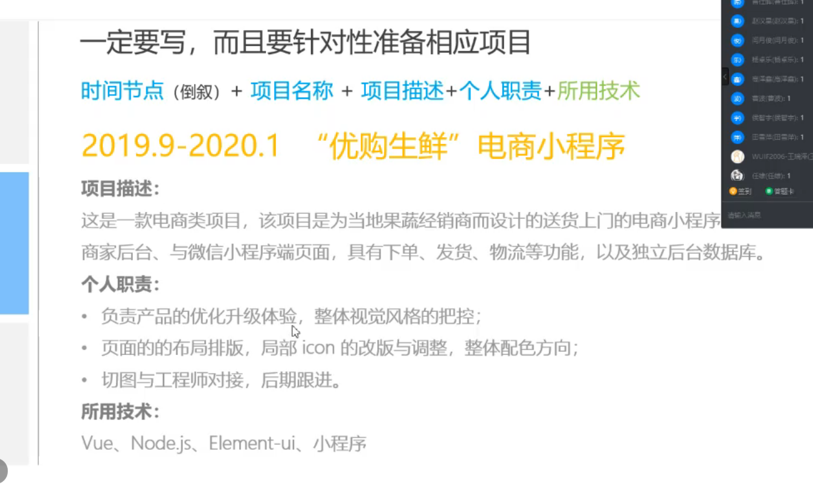

两页之内

硬汉 优斯特 诺阿

### 基本信息

### 实习经验

### 项目经验

> 时间节点 + 项目名称 + 项目描述 + 个人职责 + *所用技术*

### 其他信息

> 有针对性的爱好、曾获相关证书、作品链接

## 检查简历

### 行间距

段落行间距 固定值20-22

### 层级

### 字体

字体 微软雅黑、苹方、思源黑体

字号 10.5-11.5

字体颜色 偏灰色

### 图文排版

## 邮件礼仪

boss直聘、智联招聘、校招网站、公招号

